# Stream Deck Mirror Widget for WigiDash

[](https://github.com/yourusername/WigiDash-StreamDeckMirror-WidGet/actions/workflows/release.yml)

Um widget para [WigiDash](https://wigidash.com/) que espelha dispositivos virtuais do Elgato Stream Deck, permitindo controlar seu Stream Deck diretamente no display do WigiDash.

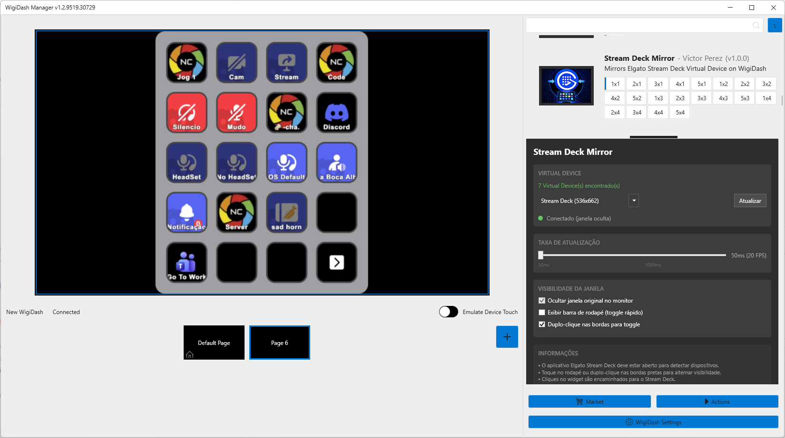
<!-- SCREENSHOT: widget-preview.png - Print do widget funcionando no WigiDash mostrando os botões do Stream Deck -->

---

## Sumário

- [O que é o WigiDash?](#o-que-é-o-wigidash)
- [Motivação](#motivação)
- [O que este Widget faz?](#o-que-este-widget-faz)
- [Funcionalidades](#funcionalidades)
- [Requisitos](#requisitos)
- [Licenciamento Elgato - Virtual Devices](#licenciamento-elgato---virtual-devices)
- [Instalação](#instalação)
- [Configuração](#configuração)
- [Uso](#uso)
- [Solução de Problemas](#solução-de-problemas)

---

## O que é o WigiDash?

O **WigiDash** é um dispositivo de hardware com display touchscreen que pode ser montado em gabinetes de PC, mesas ou qualquer superfície. Ele funciona como um painel de controle customizável, exibindo widgets que mostram informações do sistema, controlam aplicativos e muito mais.

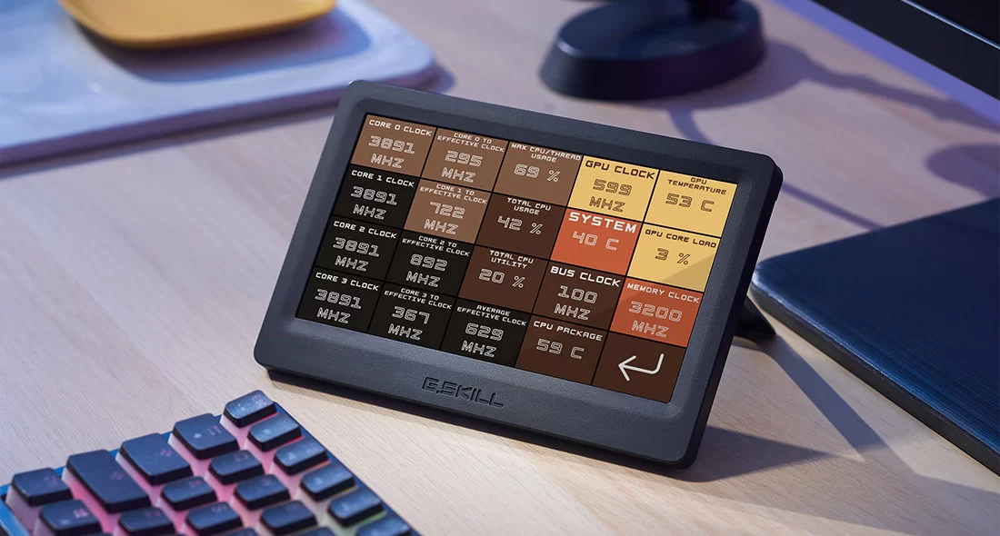
<!-- SCREENSHOT: wigidash-device.png - Foto do dispositivo WigiDash físico (pode ser imagem promocional) -->

O WigiDash suporta widgets desenvolvidos pela comunidade através de um framework .NET, permitindo que desenvolvedores criem suas próprias integrações.

---

## Motivação

O **Elgato Stream Deck** é uma ferramenta poderosa para streamers, criadores de conteúdo e usuários avançados. Porém, ter múltiplos dispositivos físicos na mesa pode ser inconveniente e caro.

**O problema:**

- Stream Deck físico ocupa espaço na mesa
- Preço elevado para ter múltiplos dispositivos
- Necessidade de olhar para outro dispositivo além do monitor

**A solução:**
Este widget permite usar o display do WigiDash como um espelho do Stream Deck Virtual, consolidando dois dispositivos em um só local. Você mantém toda a funcionalidade do Stream Deck, mas visualiza e interage através do WigiDash.

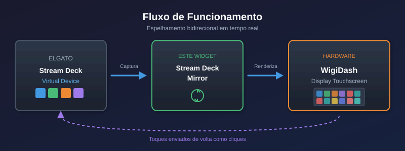

---

## O que este Widget faz?

O **Stream Deck Mirror Widget** captura a janela do Stream Deck Virtual Device e a renderiza no display do WigiDash em tempo real. Os toques no WigiDash são convertidos em cliques no Stream Deck, permitindo controle total.

### Fluxo de Funcionamento

```
┌─────────────────────┐     ┌──────────────────────┐     ┌─────────────────┐
│  Stream Deck App    │────▶│  Este Widget         │────▶│  WigiDash       │
│  (Virtual Device)   │     │  (Captura + Mirror)  │     │  (Display)      │
└─────────────────────┘     └──────────────────────┘     └─────────────────┘
         ▲                            │
         │                            │
         └────────────────────────────┘
              Cliques são enviados
              de volta para o app
```

---

## Funcionalidades

- **Espelhamento em tempo real** - Captura contínua da janela do Stream Deck Virtual
- **Taxa de atualização configurável** - De 10 FPS a 20 FPS
- **Cliques passados para o Stream Deck** - Toque no WigiDash = clique no Stream Deck
- **Múltiplos dispositivos virtuais** - Suporta seleção entre vários Virtual Devices
- **Ocultar janela original** - Esconde a janela do Virtual Device no monitor
- **Toggle rápido de visibilidade** - Duplo-clique nas bordas ou toque no rodapé
- **Indicador de status** - Mostra estado da conexão e visibilidade da janela

### Interface de Configuração

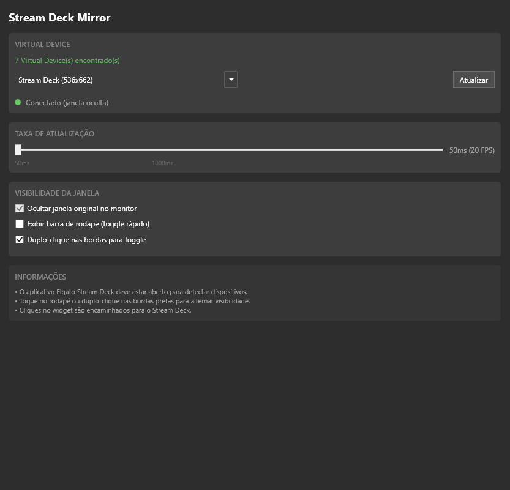
<!-- SCREENSHOT: settings-panel.png - Print da tela de configurações do widget no WigiDash -->

---

## Requisitos

### Software

- Windows 10/11
- [Elgato Stream Deck Software](https://www.elgato.com/downloads) (versão 6.0 ou superior)
- WigiDash Software
- .NET Framework 4.7.2

### Hardware

- Dispositivo WigiDash
- Licença válida para Virtual Devices da Elgato (veja seção abaixo)

---

## Licenciamento Elgato - Virtual Devices

> **Importante:** Os Virtual Devices do Stream Deck requerem uma licença válida da Elgato.

### O que são Virtual Devices?

Virtual Devices são Stream Decks "virtuais" que aparecem como janelas no Windows. Eles oferecem a mesma funcionalidade de um Stream Deck físico, mas são renderizados em software.

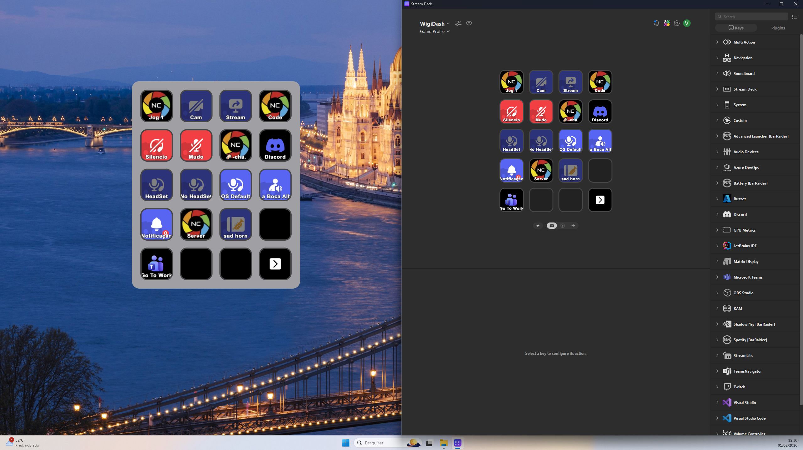
<!-- SCREENSHOT: virtual-device-window.png - Print da janela do Virtual Device do Stream Deck no Windows -->

### Como obter a licença?

A Elgato libera Virtual Devices **apenas para quem possui um dispositivo Stream Deck registrado**. Existem duas formas:

#### Opção 1: Comprar um Stream Deck físico

Qualquer modelo de Stream Deck físico (Mini, MK.2, XL, Plus, Pedal) desbloqueia os Virtual Devices permanentemente.

#### Opção 2: Stream Deck Mobile (Recomendado para este uso)

O **Stream Deck Mobile** é um aplicativo para smartphones (Android/iOS) que funciona como um Stream Deck. Ele é **significativamente mais barato** que os dispositivos físicos e também desbloqueia os Virtual Devices!

[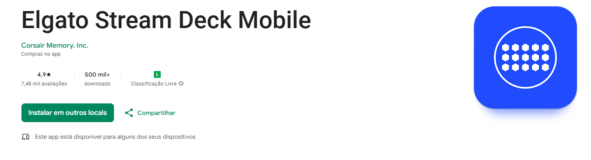](https://play.google.com/store/apps/details?id=com.corsair.android.streamdeck&hl=pt-BR)

📲 **Download:** [Stream Deck Mobile na Google Play](https://play.google.com/store/apps/details?id=com.corsair.android.streamdeck&hl=pt-BR)

**Preço aproximado:** ~R$ 25-50/ano (assinatura) ou compra única em promoções

### O Truque da Conexão Mensal

> **Dica importante para usuários do Stream Deck Mobile!**

A Elgato verifica periodicamente se você ainda possui um dispositivo válido. Para manter os Virtual Devices funcionando com o Stream Deck Mobile:

1. **Conecte seu smartphone com o app Stream Deck Mobile ao PC pelo menos uma vez por mês**
2. O aplicativo no celular deve estar aberto e conectado ao Stream Deck Software no PC
3. Após a conexão ser estabelecida, os Virtual Devices continuarão funcionando por mais ~30 dias

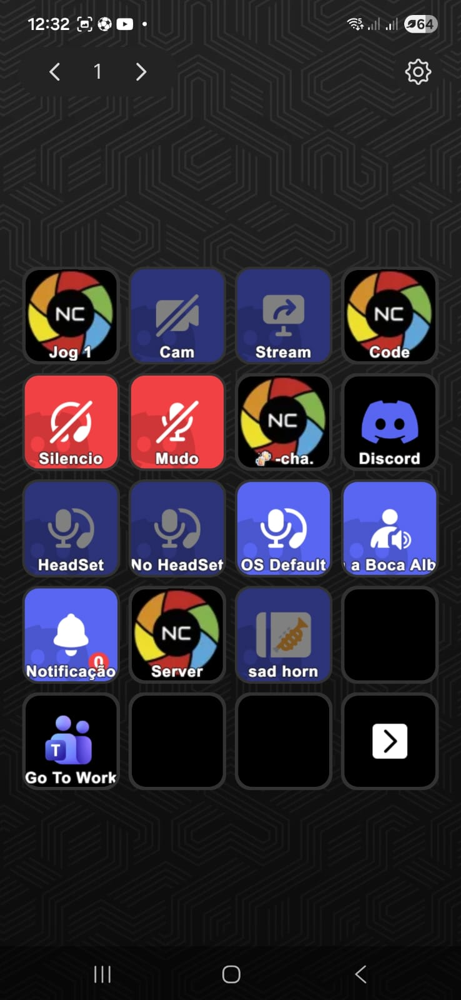
<!-- SCREENSHOT: mobile-connection.png - Print mostrando o Stream Deck Mobile conectado ao PC (tela do app ou do software mostrando o device mobile) -->

**Fluxo recomendado:**

```
Dia 1 do mês:
  1. Abra o Stream Deck no PC
  2. Abra o Stream Deck Mobile no celular
  3. Conecte ao PC via WiFi
  4. Aguarde aparecer "Connected"
  5. Pronto! Virtual Devices liberados por mais 30 dias
```

---

## Instalação

### Download

1. Vá para a página de [Releases](https://github.com/yourusername/WigiDash-StreamDeckMirror-WidGet/releases)
2. Baixe o arquivo `WigiDash-StreamDeckMirrorWidget-vX.X.X.zip` mais recente

### Instalação Manual

1. Extraia o conteúdo do ZIP
2. Copie a pasta `B7E4D1A2-5C8F-4E9B-A3D6-1F2E3B4C5D6E` para:

   ```
   %LOCALAPPDATA%\WigiDash\Widgets\
   ```

3. Reinicie o WigiDash Software

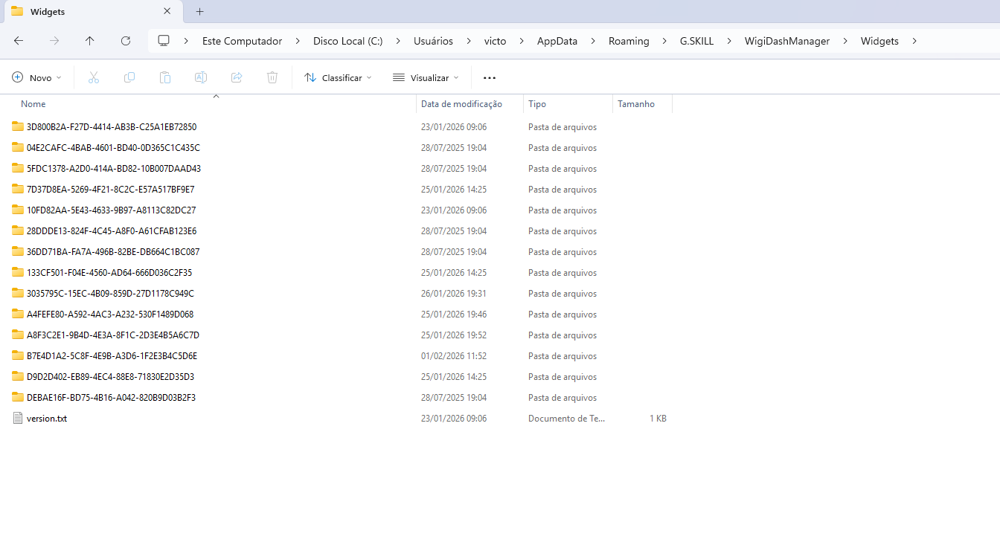
<!-- SCREENSHOT: installation-folder.png - Print da pasta de instalação mostrando a estrutura de arquivos -->

---

## Configuração

### Passo 1: Criar um Virtual Device

1. Abra o **Elgato Stream Deck** software
2. Clique no ícone de dispositivos (canto superior direito)
3. Selecione **"Add Virtual Stream Deck"**
4. Escolha o layout desejado (ex: 5x3 para Stream Deck padrão)

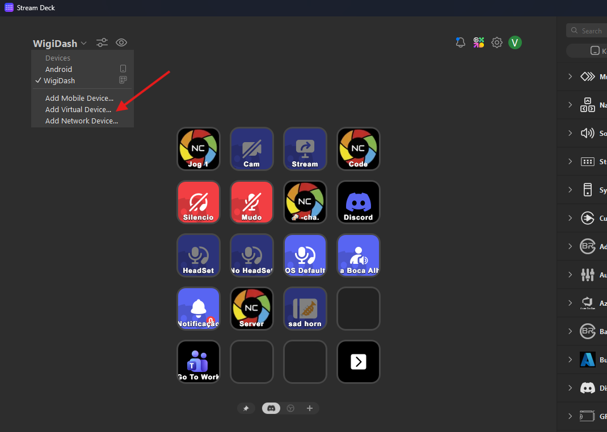
<!-- SCREENSHOT: add-virtual-device.png - Print do menu para adicionar Virtual Device no Stream Deck software -->

### Passo 2: Adicionar o Widget ao WigiDash

1. Abra o **WigiDash** software
2. Clique em **"Add Widget"**
3. Encontre **"Stream Deck Mirror"** na lista
4. Arraste para a posição desejada no layout

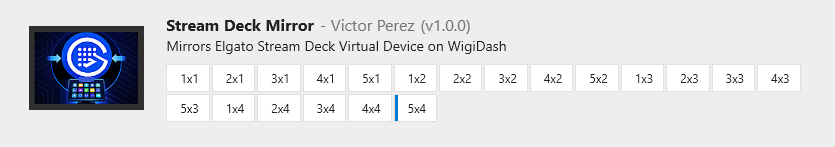
<!-- SCREENSHOT: add-widget-wigidash.png - Print do processo de adicionar o widget no WigiDash -->

### Passo 3: Selecionar o Virtual Device

1. Clique no widget para abrir as configurações
2. No dropdown **"Virtual Device"**, selecione o dispositivo desejado
3. A visualização aparecerá automaticamente

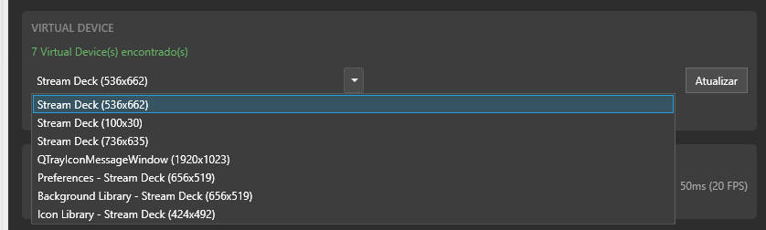
<!-- SCREENSHOT: select-device.png - Print do dropdown de seleção de dispositivo nas configurações -->

### Opções de Configuração

| Opção | Descrição |
|-------|-----------|
| **Virtual Device** | Seleciona qual Stream Deck Virtual será espelhado |
| **Taxa de atualização** | Velocidade de captura (50ms = 20 FPS, 100ms = 10 FPS) |
| **Ocultar janela original** | Esconde a janela do Virtual Device no monitor |
| **Exibir barra de rodapé** | Mostra/oculta a barra de status inferior |
| **Duplo-clique nas bordas** | Permite toggle de visibilidade com duplo-clique nas áreas pretas |

---

## Uso

### Interação Básica

- **Toque nos botões** - O toque é enviado para o Stream Deck, ativando a ação configurada
- **Toque no rodapé** - Alterna a visibilidade da janela original
- **Duplo-clique nas bordas pretas** - Alterna a visibilidade da janela (se habilitado)

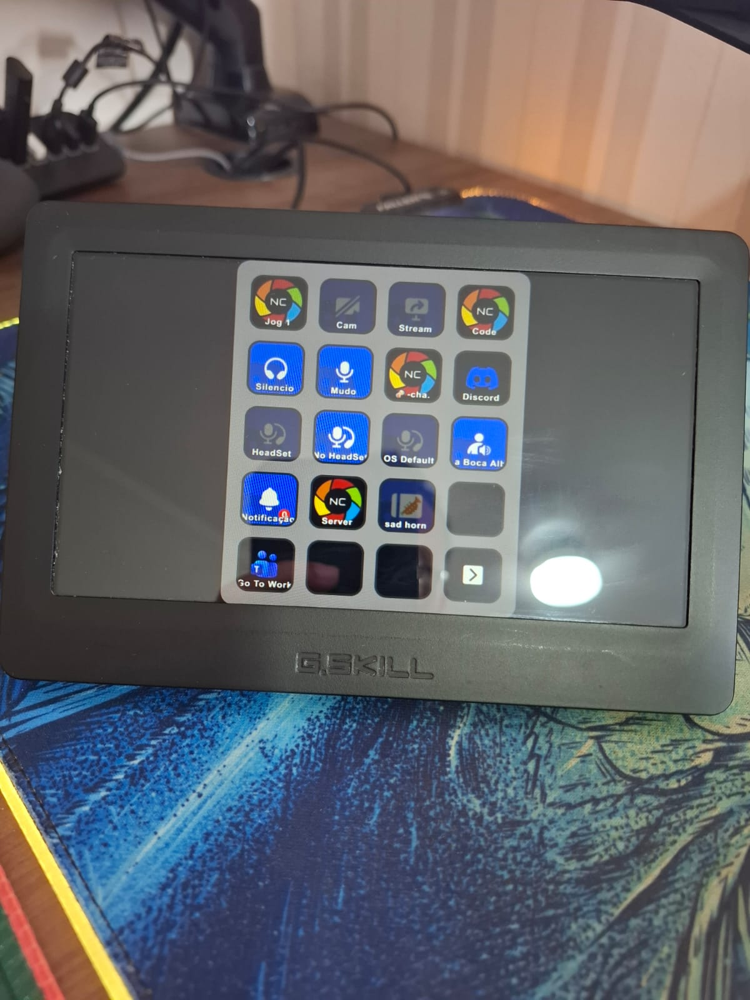
<!-- SCREENSHOT: usage-example.png - Print ou GIF mostrando o widget em uso no WigiDash -->

### Indicadores de Status

O widget mostra diferentes estados:

| Estado | Significado |
|--------|-------------|
| **Conectado** | Widget funcionando normalmente |
| **Conectado (janela oculta)** | Funcionando com janela original invisível |
| **App não está rodando** | Stream Deck software não está aberto |
| **Dispositivo não encontrado** | Virtual Device selecionado não existe mais |
| **Não configurado** | Nenhum dispositivo foi selecionado |

> Os estados são exibidos diretamente no widget quando não há conexão ativa.

---

## Solução de Problemas

### Widget mostra "App não está rodando"

- Verifique se o Elgato Stream Deck software está aberto
- O software deve estar rodando (pode estar minimizado na bandeja)

### Widget mostra "Dispositivo não encontrado"

- O Virtual Device pode ter sido removido
- Vá nas configurações e selecione outro dispositivo
- Clique em "Atualizar" para recarregar a lista

### Cliques não funcionam

- Verifique se a janela do Virtual Device não está minimizada
- Se estiver usando "Ocultar janela original", a janela deve existir (apenas invisível)
- Reinicie o Stream Deck software

### Virtual Devices não aparecem no Stream Deck

- Verifique sua licença Elgato (veja seção de licenciamento)
- Conecte o Stream Deck Mobile se for sua forma de licença
- Reinicie o Stream Deck software após conectar

### Performance baixa / Lag

- Aumente o intervalo de atualização nas configurações (ex: 100ms)
- Feche outros aplicativos que usam muita CPU
- Virtual Devices menores (ex: Mini 2x3) consomem menos recursos

---

## Estrutura de Arquivos

```
WigiDash-StreamDeckMirror-WidGet/
├── .github/
│   └── workflows/
│       └── release.yml          # GitHub Actions para releases
├── docs/
│   └── screenshots/             # Screenshots para documentação
│       └── (seus prints aqui)
├── Properties/
│   └── AssemblyInfo.cs
├── StreamDeckMirrorWidget.csproj
├── StreamDeckMirrorWidgetObject.cs
├── StreamDeckMirrorWidgetInstance.cs
├── StreamDeckMirrorSettingsControl.xaml
├── StreamDeckMirrorSettingsControl.xaml.cs
├── WindowCapture.cs
├── DeviceIdentification.cs
├── StateRenderer.cs
├── FooterBarRenderer.cs
├── AspectRatioHelper.cs
└── README.md
```

---

## Contribuindo

Contribuições são bem-vindas! Sinta-se à vontade para:

1. Fazer fork do repositório
2. Criar uma branch para sua feature (`git checkout -b feature/MinhaFeature`)
3. Commit suas mudanças (`git commit -m 'Adiciona MinhaFeature'`)
4. Push para a branch (`git push origin feature/MinhaFeature`)
5. Abrir um Pull Request

---

## Licença

Este projeto é distribuído sob a licença MIT. Veja o arquivo [LICENSE](LICENSE) para mais detalhes.

---

## Créditos

- **WigiDash** - [wigidash.com](https://wigidash.com/)
- **Elgato Stream Deck** - [elgato.com](https://www.elgato.com/stream-deck)
- Desenvolvido com auxílio do Claude AI

---

## Changelog

### v1.0.0

- Release inicial
- Espelhamento de Virtual Devices
- Configurações de taxa de atualização
- Toggle de visibilidade da janela
- Suporte a múltiplos dispositivos virtuais
